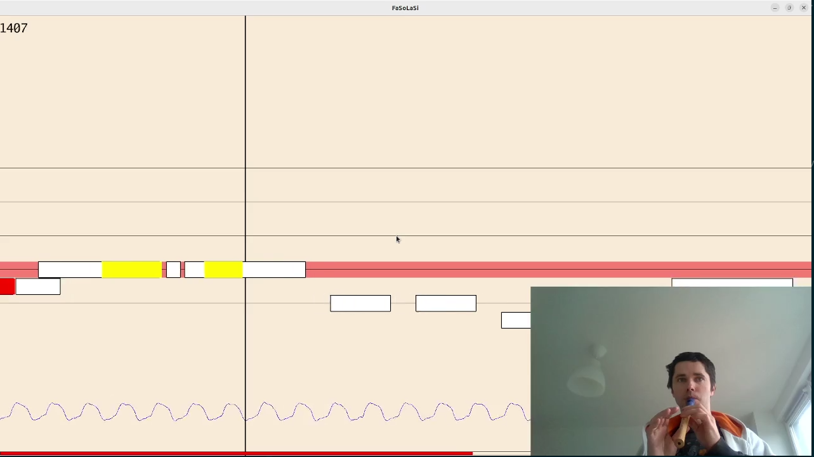

# FaSoLaSi
FaSoLaSi is a free and open source musical game for recorder (flute) that allows players to use their in strumet as a controller for the game. Written in Go, using Pixel graphis library and YIN algorithm for pitch detection.

## Gameplay
Gameplay is inspired by Guitar Hero, Frets on Fire, Synthesia and similar games. You have notes running at you, and you need to start and end playing them in the right moment. The faster you react - the better score you have. There is an additional training mode, where notes wait until you play them.

[](https://www.youtube.com/watch?v=-9oLTsaAoIM)

## Editing songs
Songs currently are written in plain text files using [LilyPond-like](http://lilypond.org/doc/v2.18/Documentation/notation/writing-pitches) simplified notation. Example:

```
g4. a8 g4 e2.
g4. a8 g4 e2.
d'2 d'4 b2.
```

Notes are separated by whitespace, pitch is marked by letter, from c to b. `'` character means to go one octave up. Lowest note is `c`, highest - `c''`. Duration is defined by number, 2 means half note, 4 means quarter, etc. Dot means to extend note by half of it's duration. If duration is not given - it defaults to 1/4 or duration of previous note.


## TODO
There is no official roadmap, I just have some random ideas:

- Fingering diagram (and option to turn it off)
- Highscores/Leaderboard
- Training mode,
	- Score should be proportional to extra time you spend on the song.
- Animations:
	- Spawn less happy emojis when correct note is played
	- Vibrate the note currently played? 
	- Some ideas of visualizations from shadertoy?  https://github.com/faiface/pixel-examples/tree/master/community/seascape-shader ? 
- Recording/creative mode. Make game listen to some music and just try to write down notes played, to create song file without text editing.
- Create binary releases for the users without Go
- Better project name?

Also there are no deadlines, I have full-time job and a kid, so help me here. :)

## Contributing
FaSoLaSi is an open source project, and any contributions are welcome. If you like the game you could:

- Tell your friends!
- Install it on your machine and write required steps for the installation section. I already forgot which audio libraries were necessary. :)
- Share notes to your favourite recorder song(s).
- Suggest improvements and new features. 
- Find and report a bug.
- Review the code and send a PRs with questions for unclear sections. I'll try to add explanations in comments.
- Recommend me a book or online-course on music theory and/or recorder, I'm complete noob in music (as you could see from demo video).
